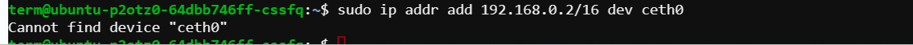

# Lab-3

**Abstract**:Connecting a network namespace with a root network namespace with the help of Bridge.


**Creating a Network Namespace(ns0)**:A network namespace provides an isolated environment for network-related operations. It's like having a separate virtual network stack.

**Create a Bridge Interface (br0)**:A bridge is a virtual network device that connects multiple network interfaces, allowing them to operate as a single logical network. In this case, it acts as a bridge between the root namespace and the ns0 namespace.

**Configure the Bridge Interface**:Set up the bridge interface by assigning it an IP address and bringing it up. This allows it to participate in network communication.

**Create Virtual Ethernet Cables (veth0 and ceth0)**:Virtual Ethernet cables are used to connect the br0 bridge interface to the ns0 namespace. They function as a pair, with one end attached to the bridge (veth0) and the other end placed within the ns0 namespace (ceth0).and bring up the virtual Ethernet cables and the interface within the ns0 namespace to enable network communication.

**Assign IP Address to ceth0 in ns0 Namespace**:Assign an IP address to the interface within the ns0 namespace (ceth0). This allows communication within the namespace.

**Set Default Gateway in the ns0 Namespace**:Specify a default gateway within the ns0 namespace to route traffic outside the namespace, typically pointing to the bridge interface.Use the ip route add command within the ns0 namespace to specify the default gateway.

**Test Connectivity**:Verify network connectivity within the ns0 namespace by pinging another IP address (e.g., 10.0.0.25). This ensures that the setup is functioning correctly and communication is established.

### ISSUES:

**Issue-1**:When we configure ns0 namespace by using ``sudo ip addr add 192.168.0.2/16 dev ceth0`` this command we face a error,



**Issue-2**: ``sudo ip link set lo up`` This command is used to bring up the loopback interface (lo) in the root network namespace.It sets the loopback interface to the "UP" state, allowing it to send and receive network traffic.

```
sudo ip netns exec ns0  ip link set lo up
```


Solution-1: We need to specify the ns0 namespace ,because ceth0 is connect with ns0 namespace.

```
sudo ip netns exec ns0 ip addr add 192.168.0.2/16 dev ceth0
```
solution-2:This command executes the specified command (ip link set lo up) within the network namespace named ns0.It brings up the loopback interface (lo) specifically within the ns0 network namespace.

```
sudo ip netns exec ns0  ip link set lo up
```

