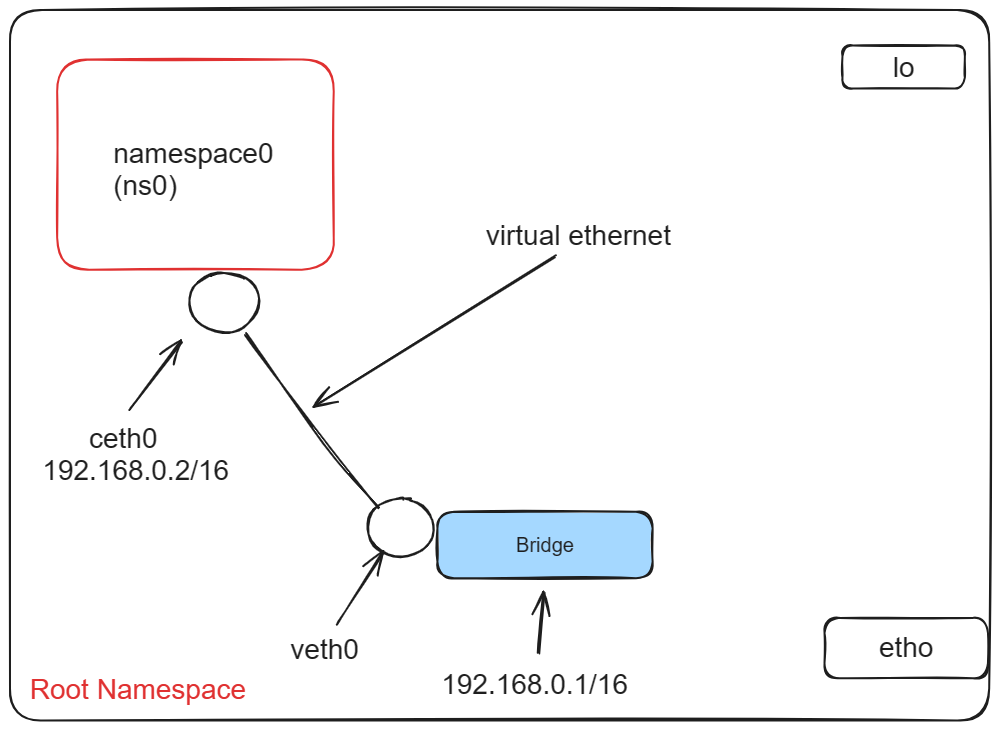
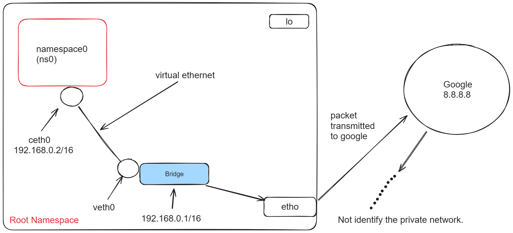
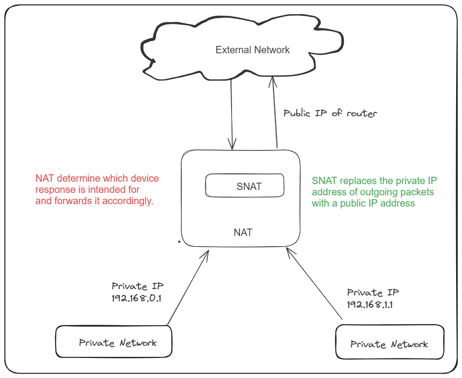
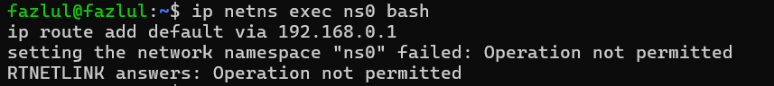

# Lab-4

**Abstract**: Connecting a network namespace with a root network namespace with the help of Bridge.Try to ping the network namespace from external service like 8.8.8.8[egress traffic]

**Creating a Network Namespace(ns0)**:A network namespace provides an isolated environment for network-related operations. It's like having a separate virtual network stack.

**Create a Bridge Interface (br0)**:A bridge is a virtual network device that connects multiple network interfaces, allowing them to operate as a single logical network. In this case, it acts as a bridge between the root namespace and the ns0 namespace.

**Configure the Bridge Interface**:Set up the bridge interface by assigning it an IP address and bringing it up. This allows it to participate in network communication.

**Create Virtual Ethernet Cables (veth0 and ceth0)**:Virtual Ethernet cables are used to connect the br0 bridge interface to the ns0 namespace. They function as a pair, with one end attached to the bridge (veth0) and the other end placed within the ns0 namespace (ceth0).and bring up the virtual Ethernet cables and the interface within the ns0 namespace to enable network communication.

**Assign IP Address to ceth0 in ns0 Namespace**:Assign an IP address to the interface within the ns0 namespace (ceth0). This allows communication within the namespace.

**Set Default Gateway in the ns0 Namespace**:Specify a default gateway within the ns0 namespace to route traffic outside the namespace, typically pointing to the bridge interface.Use the ip route add command within the ns0 namespace to specify the default gateway.



**Test Connectivity**:Verify network connectivity within the ns0 namespace by pinging another IP address (e.g., 10.0.0.25). This ensures that the setup is functioning correctly and communication is established.

# Ping Google from ns0 Namespace

Initially, attempting to ping 8.8.8.8 from a custom namespace (ns0) results in unsuccessful communication.

*Why we can't ping google?*

Using tcpdump reveals that packets are reaching the interfaces (br0 and ens3), but they are stuck in ns0.



The root cause is identified as the source IP address (192.168.0.2) attempting to connect to 8.8.8.8 using its private IP address, which is not reachable from the outside world.

**Solution**:Implementing Network Address Translation (NAT) using a Source NAT (SNAT) rule. 

**NAT (Network Address Translation)**: A technique used to modify network address information in packet headers to facilitate communication between devices in different networks.
It enables devices in a private network to communicate with devices outside the network by translating private IP addresses to public IP addresses and vice versa.

```
sudo iptables -t nat -A POSTROUTING -s 192.168.0.0/16 -j MASQUERADE
```

This rule modifies the source IP address of outgoing packets from the subnet 192.168.0.0/16 (which likely represents the private IP addresses in the network) to a public IP address.The MASQUERADE action used in the NAT rule essentially performs SNAT by replacing the source IP address of outgoing packets with a public IP address.



**SNAT (Source NAT)**: A specific type of NAT that modifies the source IP address of outgoing packets. It's often used to translate private IP addresses to public IP addresses, enabling communication between devices in a private network and external networks such as the internet.

# Firewall configuration

The additional firewall rules are needed to allow all traffic to pass through the br0 interface without restrictions. This ensures smooth communication between devices within the network and with external networks, facilitating the functioning of NAT and SNAT processes and simplifying network configuration. 

# ISSUES

Add a Default Gateway in the route table.

```
ip netns exec ns0 bash
ip route add default via 192.168.0.1
```


**Solution**:We need to add sudo to exec the both commands

```
sudo ip netns exec ns0 bash
sudo ip route add default via 192.168.0.1
```