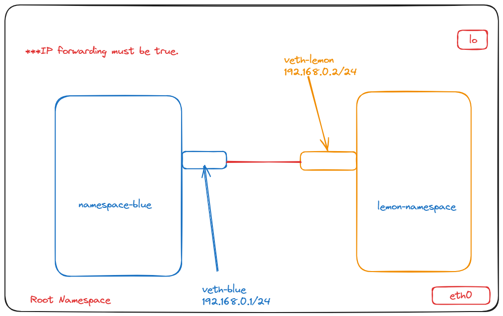
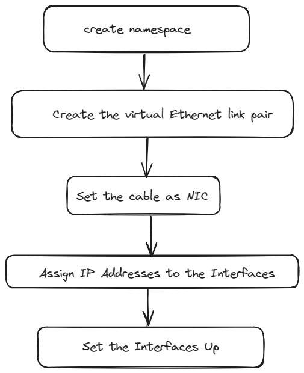

# LAB-5

**Abstract**:Communication between two network namespace

**1.Enable IP forwarding in the Linux kernel**: By default, Linux kernel doesn't forward packets between network interfaces. Enabling IP forwarding allows the kernel to forward packets between different interfaces, essentially turning the system into a router.However ``sudo sysctl -w net.ipv4.ip_forward=1`` this command enable ip forwarding for temporay.It will be reset after each session.

**2.Creating Namespace and enable virtual Ethernet link pair**:Network namespaces provide isolation and act as separate environments with their own network stack. In this step, you're creating two namespaces named blue-namespace and lemon-namespace.Virtual Ethernet (veth) pairs act like virtual Ethernet cables. They come in pairs, with packets sent through one end of the pair being received at the other end. Here, you're creating a pair named veth-blue and veth-lemon.After creating the virtual Ethernet pair, you assign each end of the pair to a different namespace. This effectively creates network interfaces within each namespace. Each interface is assigned with an IP address within the same subnet to ensure they can communicate with each other.

After assigning IP addresses, you bring the interfaces up. This step activates the interfaces and enables them to send and receive data.

**3.Set Default Routes**: Setting default routes determines where packets should be sent if there's no specific route configured for a destination. Here, you're setting default routes within each namespace so they know where to send packets destined for the other namespace.

**4.Test Connectivity**: With everything set up, you can now test connectivity between the namespaces. This is done by using the ping command to send ICMP echo request packets between the IP addresses assigned to the interfaces in each namespace.

# Clean UP

Cleaning up after configuring network namespaces is important for optimizing resource management.By removing unused namespaces, interfaces, IP addresses, and routes, you ensure efficient resource utilization
