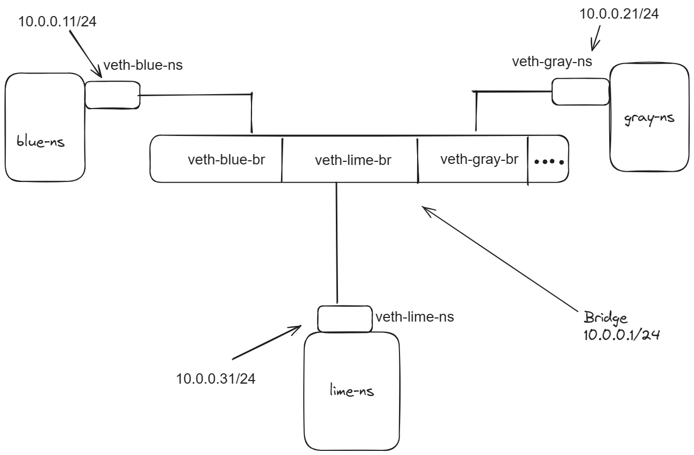

# Lab-6

**Abstract**: Setting up a Linux bridge network among namespaces

Setting up a Linux bridge network among namespaces involves several steps to create isolated network environments and establish communication between them. The process begins with creating a Linux bridge, assigning IP addresses, creating namespaces, and configuring virtual Ethernet pairs as usal.Next, the virtual interfaces are moved to their respective namespaces, and the other end of the interfaces is added to the bridge.

<div style="text-align:center"></div>

After setting up the bridge and namespace interfaces, IP addresses are assigned to the virtual interfaces within each namespace, and default routes are set. Finally, connectivity between the namespaces is tested using ping commands

*Firewall Rules : The firewall rules added in this setup are optional and are used to allow traffic to pass through the Linux bridge without any restrictions.*

```
sudo iptables --append FORWARD --in-interface v-net --jump ACCEPT
sudo iptables --append FORWARD --out-interface v-net --jump ACCEPT
```

These commands append rules to the FORWARD chain of the iptables firewall. They specify that any traffic coming into or going out of the v-net interface (which represents our Linux bridge) should be accepted, allowing it to pass through without any restrictions.

**Clean Up**Cleanup step is essential for efficient resource management, avoiding conflicts, enhancing security, and maintaining system simplicity.