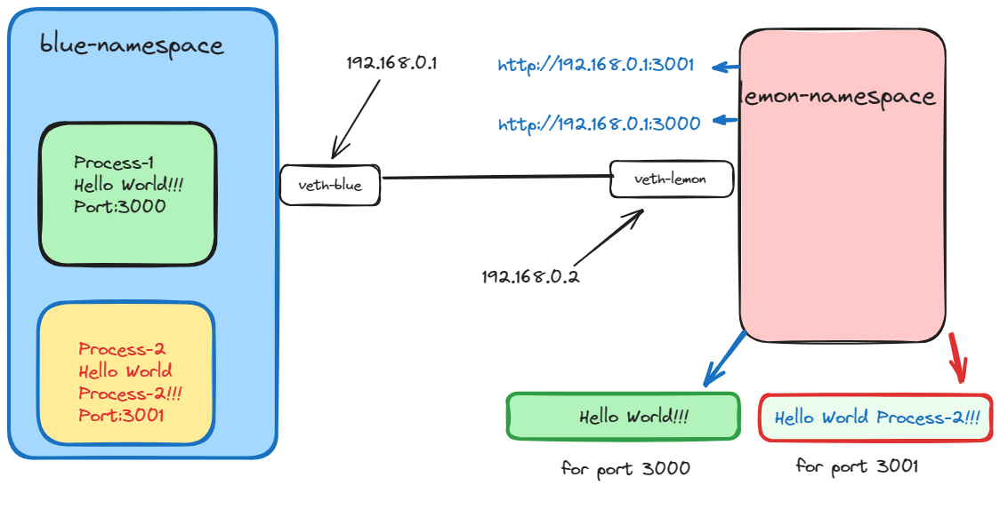
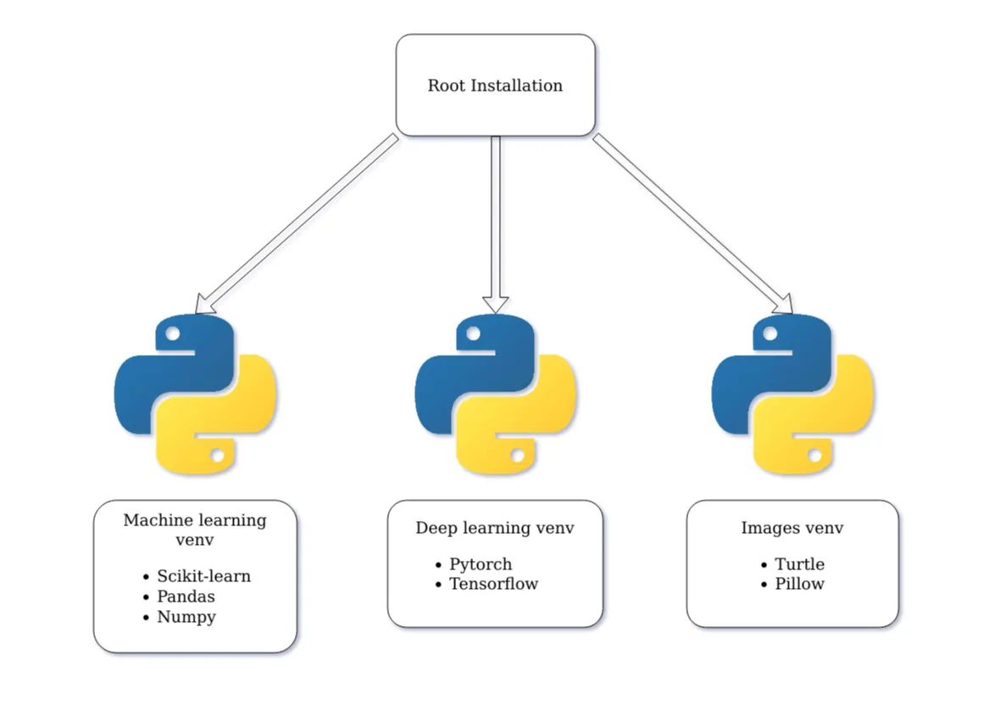
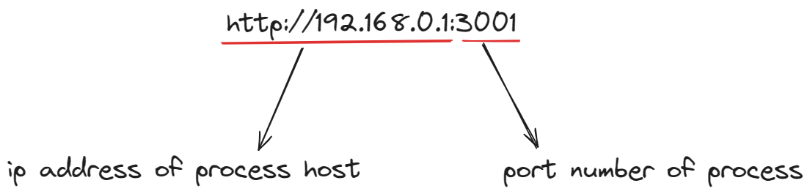

# Lab-7

**Abstract**:Accessing a process running in one namespace from another namespace.

**Connection setup between two namespace with appropiate properties**: The initial steps involve configuring the Linux kernel to enable IP forwarding, a fundamental requirement for network communication between namespaces. Subsequently, the creation of isolated namespaces ensures the segregation of resources, fostering enhanced security and resource management. The establishment of a virtual Ethernet link pair acts as the conduit for communication between namespaces, facilitated by assigning IP addresses to each interface within the namespaces. Bringing these interfaces up initiates network connectivity, while setting default routes ensures proper routing of network traffic within each namespace, culminating in a robust networking setup. This systematic configuration enables seamless communication between isolated environments.

<div style="text-align:center"></div>

# Server setup in a namespace(blue-namespace)

**Virtual env setup**: Virtual environments in Python, commonly referred to as "virtualenvs" or "venvs," offer developers a means to create isolated environments tailored to specific projects. These environments encapsulate a distinct Python interpreter along with its dependencies, libraries, and scripts, shielding each project from interference with the global Python installation or other projects. This isolation is crucial for managing project-specific dependencies efficiently and avoiding conflicts between different versions of packages.

<div style="text-align:center"></div>

**Running a simple server with flask in a namespace (blue-namespace)**:You need to install flask on venv.Then make a simple script which listen on 0.0.0.0 and also mention the port in which the process will run.If we provide host=``0.0.0.0`` it can listen from entire namespace of machine.After writing the server code, you execute the Python script to start the server within the namespace. Since you're already inside the namespace, you simply run the Python script as usual.(``python3 server.py``)


**Testing the server from different namespace (lemon-namespace)**:Once the server is running, you can test its functionality from within the same or another namespace.For testing purpose you can use ``curl``.In address we need to mention the ip address along with the port number in which the process is running.

<div style="text-align:center"></div>

For example if the process is running in blue-namespace which has ip ``192.168.0.1`` and the process-1 is running in port 3000,and if you want to access it from lemon-namespace,you nedd to use 

```
curl -v http://192.168.0.1:30001
```