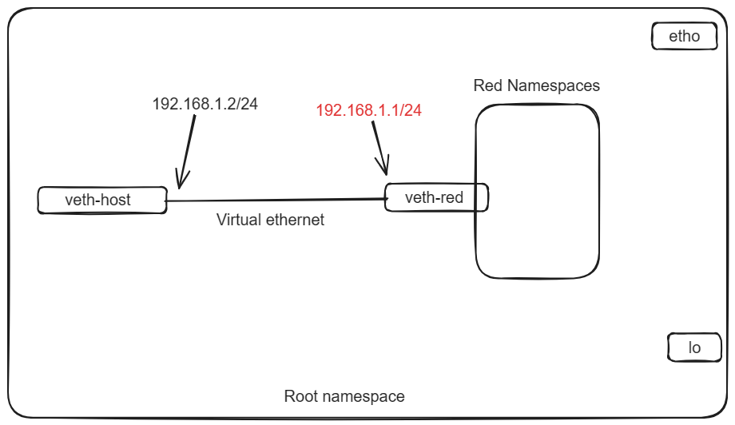

# Lab-2

**Abstract**: Creating Network namespace and connect it with root namespace using virtual ethernet connection and also test the connection.

## How the process works:

**1.Creating a Network Namespace**: ``sudo ip netns add red``This command creates a network namespace named "red". Network namespaces provide isolation at the network level, allowing you to have separate network stacks, interfaces, routing tables, etc.

**2.Adding Virtual Ethernet Cable**: Creating a virtual Ethernet cable involves generating a linked pair of virtual Ethernet interfaces, namely veth-red and veth-host. While veth-host remains in the root namespace, veth-red is transferred into the "red" namespace, thus establishing connectivity between the two namespaces.

**3.Adding Route on Host**:``sudo ip route add 192.168.1.1 dev veth-host``This command adds a route to the routing table of the root namespace. It specifies that traffic destined for 192.168.1.1 (the IP address of the "red" namespace) should be sent through the veth-host interface.

### *Importance of adding route on host*:
    
**Routing Decision**:When a packet is generated on the host destined for an IP address within the "red" namespace (e.g., 192.168.1.1), the host's networking stack needs to know how to reach that destination. Without a specific route, the host would not know that it should send traffic destined for 192.168.1.1 through the veth-host interface.

**Default Routing Behavior**:By default, the host's networking stack follows its routing table to determine where to send packets. Without a specific route for the "red" namespace, the host would likely use its default route, which might not direct traffic to the correct interface or destination.

**Isolation**: Network namespaces provide isolation, meaning that each namespace has its own set of interfaces, IP addresses, and routing tables. By adding a route on the host explicitly directing traffic to the "red" namespace, you ensure that traffic meant for that namespace is correctly routed and isolated from other namespaces or networks on the host.

**4.Testing Connectivity**:``ping 192.168.1.1 -c 3``This command sends three ICMP echo request packets to the IP address 192.168.1.1 (the IP address of the "red" namespace) from the veth-host interface.``sudo ip netns exec red ping 192.168.1.2 -c 3`` This command enters the "red" namespace and sends three ICMP echo request packets to the IP address 192.168.1.2 (the IP address of the veth-host interface) from within the namespace.