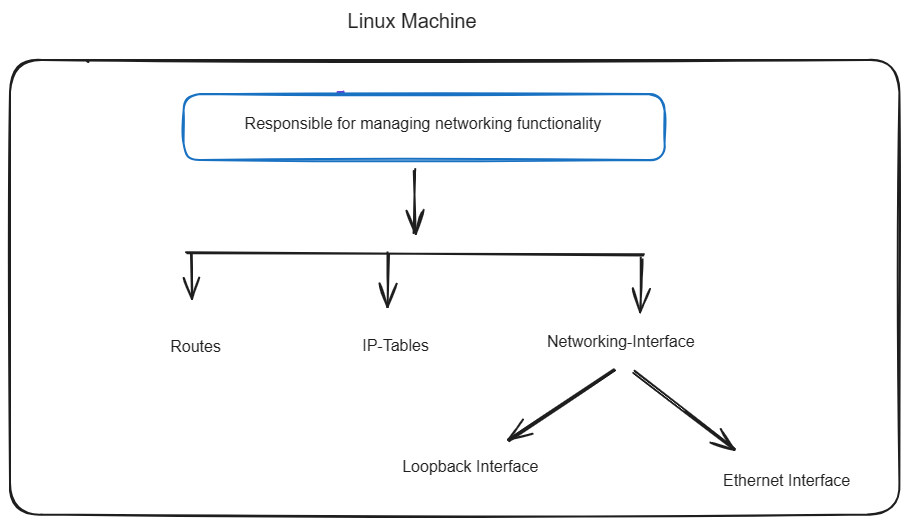

# Lab-1 : 


**Abstract**: Understanding the Linux network stack and create custom network namespace. 

The Linux network stack is a layered architecture responsible for managing networking functionality within the operating system. Some key components are 
1.Network Interfaces 
     i.Loopback Interface 
     ii.Ethernet Interface
2.IPtables
3.Routing



**1.lo (Loopback Interface) & eth0 (Ethernet Interface 0)**: 'lo' allows communication within a single device. It's commonly used for testing network software or accessing services running on the local machine.'etho0' is often used for external connections to networks, such as connecting to the internet or other devices on a local network.

**2.IPtables**: This is a powerful firewall utility that allows administrators to configure rules to control network traffic. It's used for tasks like packet filtering, network address translation (NAT), and port forwarding.

**3.Routes**: These are instructions within the system that define how network traffic should be directed from its source to its destination. They essentially provide the road map for data packets.


# ISSUES:

Some necessary tools which are required for testing are missing ,we were not able to run basic commands like 'ifconfig lo','ip link list'.We need to manually install the packages.

To run the commands seamlessly install this packages first:

```
sudo apt update
sudo apt install net-tools
sudo apt install iproute2
sudo apt install iptables
```
 
 ``iptables`` is a powerful tool for configuring packet filtering rules in the Linux kernel's netfilter framework


``net-tools`` package includes a collection of networking tools, including ifconfig, netstat, arp, and others.

``iproute2`` package, which contains the ip command and other networking utilities

# Networking Namespace:

A network namespace is a Linux kernel feature that provides a virtualized network stack, enabling processes within the namespace to have their own network interfaces, routing tables, firewall rules, and other network-related resources. This isolation allows different processes or applications to operate in independent network environments, providing flexibility, security, and resource isolation.
